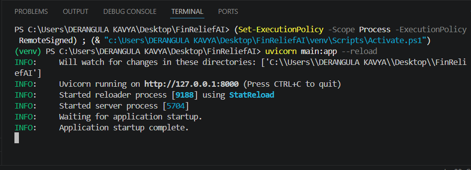
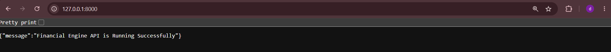
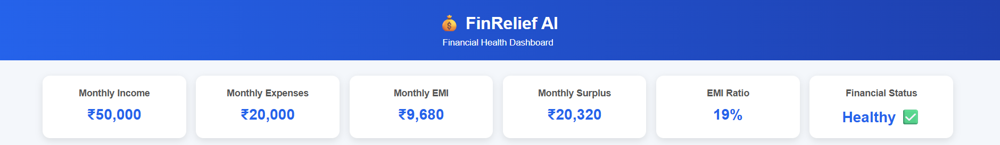
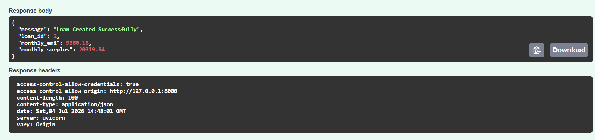
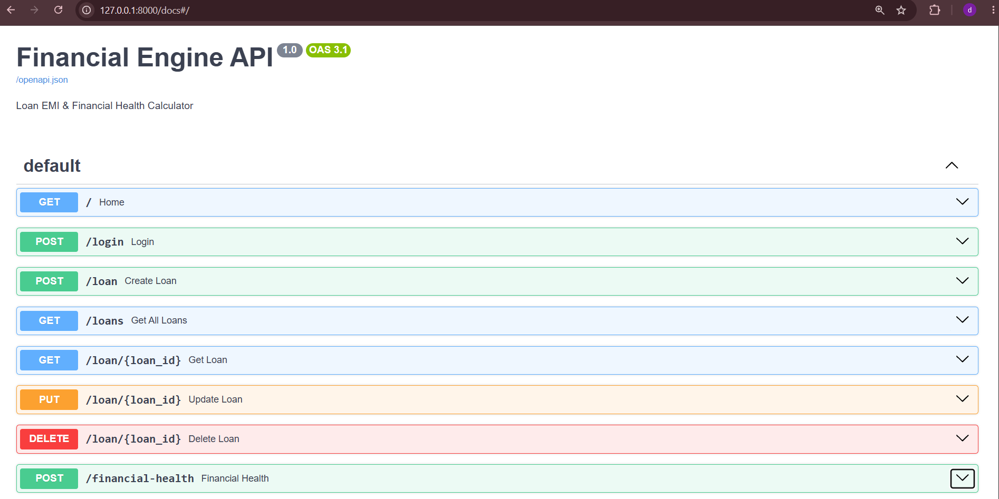
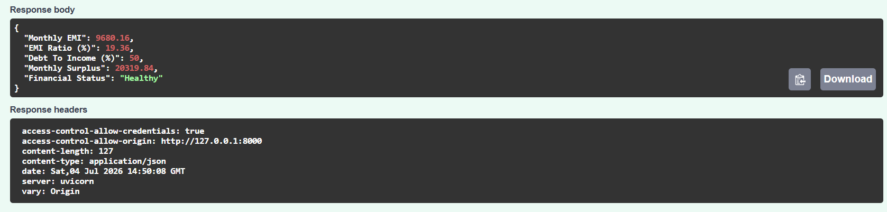
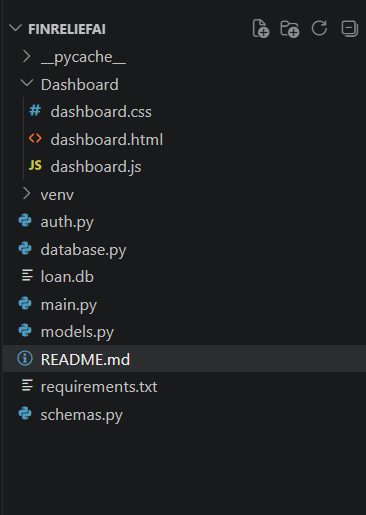
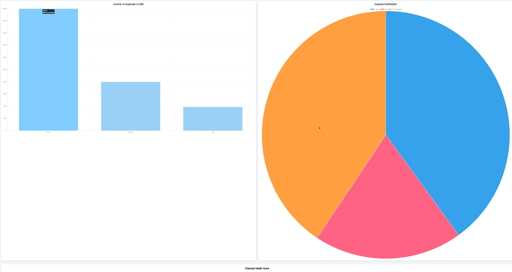
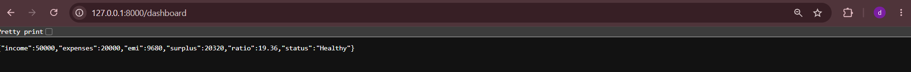
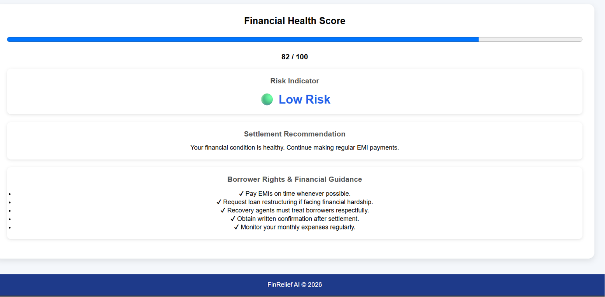

# FinRelief AI – Financial Engine & Dashboard

## Project Description

FinRelief AI is a financial health analysis system developed using FastAPI and SQLite. The application helps borrowers analyze their loan repayment capacity by calculating important financial metrics such as Monthly EMI, EMI-to-Income Ratio, Debt-to-Income Ratio, Monthly Surplus, and Financial Health Status. It also provides a responsive dashboard for visualizing financial information.

## Features

* User Login API
* Loan Management (Create, Read, Update, Delete)
* EMI Calculation
* EMI-to-Income Ratio Calculation
* Debt-to-Income Ratio Calculation
* Monthly Surplus Calculation
* Financial Health Analysis
* Interactive Dashboard
* REST API using FastAPI
* SQLite Database
* Swagger API Documentation

## Technologies Used

* Python
* FastAPI
* SQLite
* SQLAlchemy
* Pydantic
* HTML
* CSS
* JavaScript
* Chart.js

## Project Structure

FinReliefAI
│
├── main.py
├── database.py
├── models.py
├── schemas.py
├── auth.py
├── requirements.txt
├── loan.db
│
└── dashboard
    ├── dashboard.html
    ├── dashboard.css
    └── dashboard.js

## Installation

1. Create a virtual environment.
2. Activate the virtual environment.
3. Install the required packages.

pip install -r requirements.txt

4. Run the application.

uvicorn main:app --reload

5. Open Swagger Documentation:

http://127.0.0.1:8000/docs

## API Endpoints

* POST /login
* POST /loan
* GET /loans
* GET /loan/{loan_id}
* PUT /loan/{loan_id}
* DELETE /loan/{loan_id}
* POST /financial-health
## 📸 Screenshots

### Terminal Page

### API Page

### Dashboard

### Loan Form

### Swagger UI

### financial health api

### project structure

### financial dashboard-charts

### dashboard print

### settlement-result

## Outcome

The project successfully calculates financial health metrics, manages loan records, and provides a professional dashboard for financial visualization using FastAPI and SQLite.

## Developed By
kavya